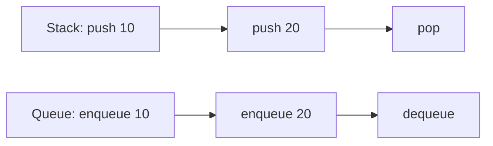
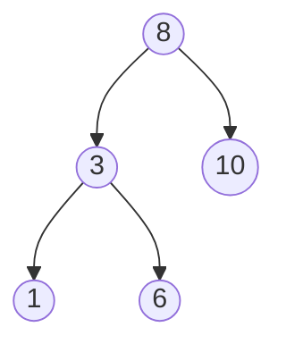
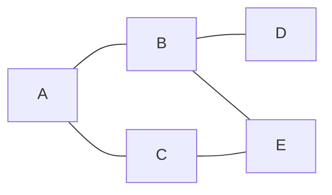
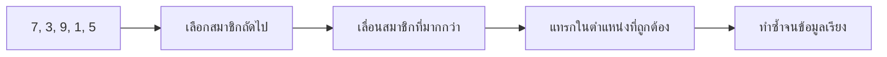
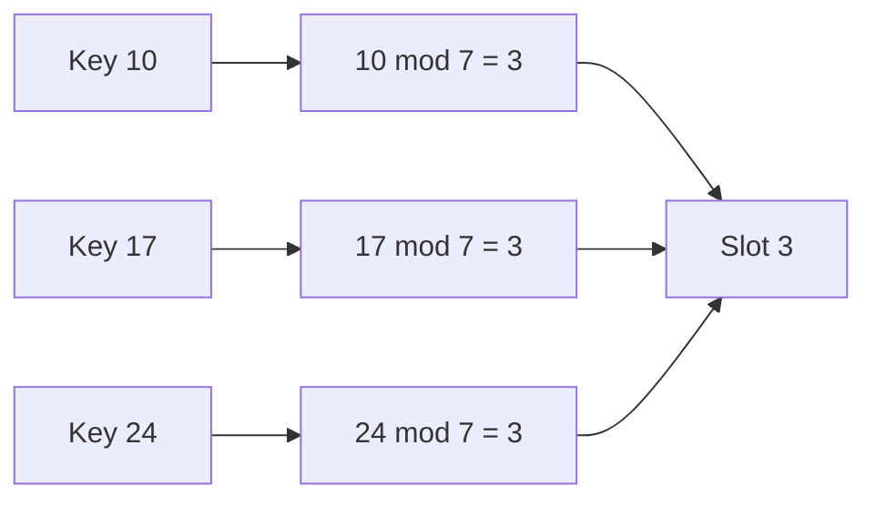
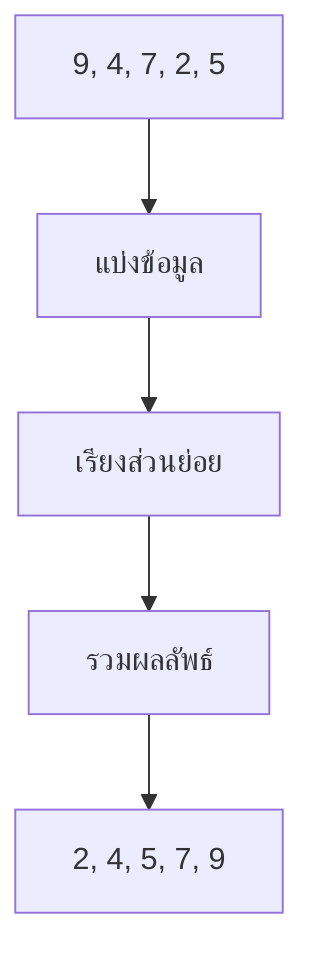
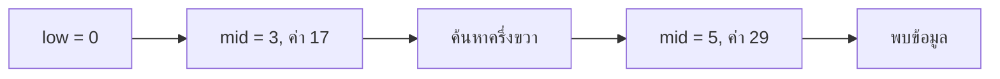
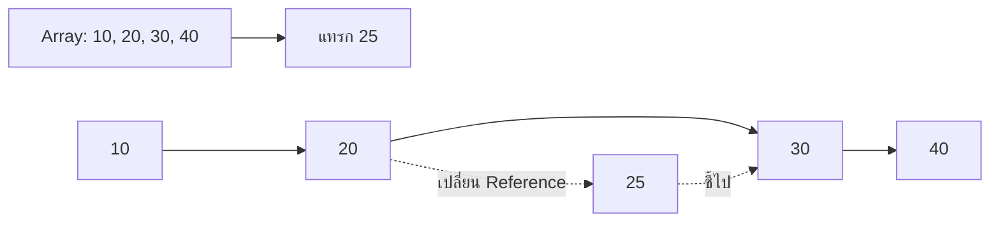
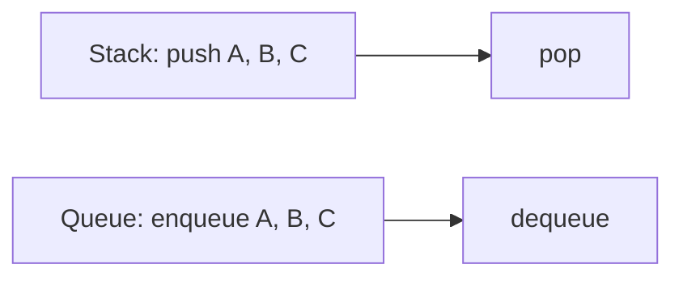
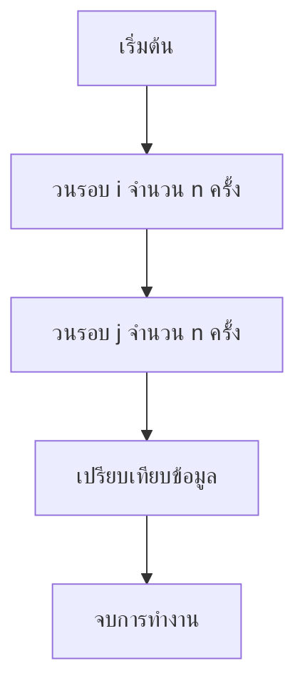

# แบบทดสอบอัลกอริทึมและโครงสร้างข้อมูล

## ตอนที่ 1 ข้อสอบแบบมีตัวเลือก

เลือกคำตอบที่ถูกต้องที่สุด โดยบางข้อเป็นโจทย์วิเคราะห์สถานการณ์และการเปรียบเทียบประสิทธิภาพ

1. อัลกอริทึมหมายถึงอะไร
    - ก. วิธีจัดเก็บข้อมูลในหน่วยความจำ
    - ข. ขั้นตอนการแก้ปัญหาอย่างเป็นลำดับ
    - ค. ชนิดข้อมูลพื้นฐาน
    - ง. โปรแกรมที่ทำงานโดยไม่มีเงื่อนไข
    - จ. ผลลัพธ์ที่ได้จากการประมวลผลเพียงอย่างเดียว

2. Big-O ใช้อธิบายสิ่งใด
    - ก. สีของโปรแกรม
    - ข. จำนวนบรรทัดของโค้ดเท่านั้น
    - ค. อัตราการเติบโตของเวลาและพื้นที่เมื่อข้อมูลเพิ่มขึ้น
    - ง. จำนวนผู้ใช้ระบบ
    - จ. ค่าความถูกต้องของผลลัพธ์เท่านั้น

3. ข้อใดมีความซับซ้อนต่ำที่สุดเมื่อ `n` มีค่ามาก
    - ก. `O(n^2)`
    - ข. `O(n log n)`
    - ค. `O(log n)`
    - ง. `O(2^n)`
    - จ. `O(n!)`

4. การเข้าถึงสมาชิก Array ด้วยดัชนีมีความซับซ้อนเท่าใด
    - ก. `O(1)`
    - ข. `O(log n)`
    - ค. `O(n)`
    - ง. `O(n^2)`
    - จ. `O(2^n)`

5. โครงสร้างข้อมูลใดทำงานแบบ LIFO
    - ก. Queue
    - ข. Stack
    - ค. Graph
    - ง. Hash Table
    - จ. Priority Queue เสมอไป

6. โครงสร้างข้อมูลใดทำงานแบบ FIFO
    - ก. Stack
    - ข. Tree
    - ค. Queue
    - ง. Array
    - จ. Stack ที่เพิ่มข้อมูลแบบต่อท้าย

7. การเพิ่มข้อมูลเข้าสู่ Stack เรียกว่าอะไร
    - ก. Push
    - ข. Enqueue
    - ค. Dequeue
    - ง. Probe
    - จ. Hashing

8. การเพิ่มข้อมูลเข้าสู่ Queue เรียกว่าอะไร
    - ก. Pop
    - ข. Peek
    - ค. Enqueue
    - ง. Hash
    - จ. Insert ที่ด้านบนของ Stack

9. ข้อใดเป็นข้อดีของ Linked List
    - ก. เข้าถึงทุกตำแหน่งได้ `O(1)`
    - ข. เพิ่มหรือลบข้อมูลได้สะดวกเมื่อมีตำแหน่งของ Node
    - ค. ใช้หน่วยความจำต่อเนื่องเสมอ
    - ง. ไม่ต้องใช้ Pointer หรือ Reference
    - จ. ค้นหาข้อมูลตามดัชนีได้เร็วกว่า Array

10. โครงสร้างข้อมูลใดเหมาะกับการเข้าถึงตามตำแหน่ง
    - ก. Array
    - ข. Linked List
    - ค. Queue
    - ง. Graph
    - จ. Linked List แบบไม่เรียงลำดับ

11. โหนดบนสุดของ Tree เรียกว่าอะไร
    - ก. Leaf
    - ข. Root
    - ค. Child
    - ง. Edge
    - จ. ไม่มีข้อใดถูกต้อง

12. Binary Tree หนึ่งโหนดมีโหนดลูกได้มากที่สุดกี่โหนด
    - ก. 1 โหนด
    - ข. 2 โหนด
    - ค. 3 โหนด
    - ง. ไม่จำกัด
    - จ. ไม่มีข้อใดถูกต้อง

13. การท่อง Tree แบบ Inorder มีลำดับใด
    - ก. Root - Left - Right
    - ข. Left - Root - Right
    - ค. Left - Right - Root
    - ง. Right - Root - Left
    - จ. ไม่มีข้อใดถูกต้อง

14. แทรกค่า `8, 3, 10, 1, 6` ลงใน BST ตามลำดับ ลำดับ Inorder ที่ถูกต้องคือข้อใด
    - ก. `8, 3, 1, 6, 10`
    - ข. `1, 3, 6, 8, 10`
    - ค. `1, 6, 3, 10, 8`
    - ง. `10, 8, 6, 3, 1`
    - จ. `3, 1, 8, 10, 6`

15. ถ้า Tree มี Node จำนวน `n` จะมี Edge จำนวนเท่าใด
    - ก. `n`
    - ข. `n + 1`
    - ค. `n - 1`
    - ง. `2n`
    - จ. ไม่มีข้อใดถูกต้อง

16. หากแทรกข้อมูล `1, 2, 3, ..., n` ลงใน BST ที่ไม่มีการปรับสมดุล ความซับซ้อนการค้นหาในกรณีแย่ที่สุดเป็นเท่าใด
    - ก. `O(1)` เพราะค้นหาจาก Root
    - ข. `O(log n)` เสมอ เพราะเป็น BST
    - ค. `O(n)` เพราะต้นไม้อาจเอียงเป็นเส้นตรง
    - ง. `O(n^2)` สำหรับการค้นหาเพียงครั้งเดียว
    - จ. `O(2^n)` เพราะมีการแตกกิ่ง

17. Graph ประกอบด้วยองค์ประกอบหลักใด
    - ก. Root และ Leaf
    - ข. Vertex และ Edge
    - ค. Key และ Value
    - ง. Push และ Pop
    - จ. ไม่มีข้อใดถูกต้อง

18. Graph ที่ Edge มีทิศทางเรียกว่าอะไร
    - ก. Directed Graph
    - ข. Complete Graph
    - ค. Tree Graph
    - ง. Sorted Graph
    - จ. ไม่มีข้อใดถูกต้อง

19. BFS ใช้โครงสร้างข้อมูลใดเป็นหลัก
    - ก. Stack
    - ข. Queue
    - ค. Heap เท่านั้น
    - ง. Linked List เท่านั้น
    - จ. ไม่มีข้อใดถูกต้อง

20. DFS สามารถทำงานได้โดยใช้สิ่งใด
    - ก. Queue เท่านั้น
    - ข. Stack หรือ Recursive Call
    - ค. Hash Function เท่านั้น
    - ง. Sorted Array เท่านั้น
    - จ. ไม่มีข้อใดถูกต้อง

21. ต้องหาเส้นทางที่มีจำนวน Edge น้อยที่สุดจากสถานี A ในแผนที่ที่ถนนทุกเส้นถือว่ามีค่าเท่ากัน ควรใช้วิธีใด
    - ก. BFS
    - ข. DFS เพราะค้นหาให้ลึกที่สุด
    - ค. Dijkstra เท่านั้น แม้ไม่มีน้ำหนัก
    - ง. Quick Sort
    - จ. Hash Table

22. หากกราฟมี Vertex 100 จุดและใช้ Adjacency Matrix พื้นที่จัดเก็บจะเติบโตตามข้อใด
    - ก. คงที่ ไม่ขึ้นกับจำนวน Vertex
    - ข. `O(log V)`
    - ค. `O(V)`
    - ง. `O(V^2)` หรือประมาณ 10,000 ช่อง
    - จ. `O(E log V)` เท่านั้น

23. Adjacency List เหมาะกับกราฟลักษณะใด
    - ก. กราฟเบาบาง
    - ข. กราฟที่ไม่มี Edge
    - ค. กราฟที่ต้องใช้ตารางเต็มเสมอ
    - ง. กราฟที่มี Vertex เพียงหนึ่งจุดเท่านั้น
    - จ. ไม่มีข้อใดถูกต้อง

24. ระบบนำทางมี Edge เป็นระยะทางและไม่มีระยะทางติดลบ อัลกอริทึมใดเหมาะสำหรับหาเส้นทางสั้นที่สุดจากจุดเริ่มต้น
    - ก. BFS เท่านั้น เพราะมี Edge ทุกเส้น
    - ข. Dijkstra
    - ค. Bellman-Ford เท่านั้นเมื่อไม่มีน้ำหนักติดลบ
    - ง. Selection Sort
    - จ. Inorder Traversal

25. เครือข่ายสายสื่อสารต้องเชื่อมอุปกรณ์ทุกจุดด้วยค่าใช้จ่ายรวมต่ำที่สุดและไม่เกิดวงจร เงื่อนไขนี้ตรงกับโครงสร้างใด
    - ก. Shortest Path จากจุดเริ่มต้นเพียงจุดเดียว
    - ข. Minimum Spanning Tree
    - ค. Complete Graph ที่มี Edge มากที่สุด
    - ง. Directed Acyclic Graph เท่านั้น
    - จ. Binary Search Tree

26. Bubble Sort เปรียบเทียบข้อมูลลักษณะใดเป็นหลัก
    - ก. ข้อมูลที่อยู่ติดกัน
    - ข. ข้อมูลตัวแรกกับตัวสุดท้ายเท่านั้น
    - ค. Root กับ Leaf
    - ง. Key กับ Hash Function
    - จ. ไม่มีข้อใดถูกต้อง

27. อัลกอริทึมใดเหมาะกับข้อมูลที่เกือบเรียงแล้ว
    - ก. Insertion Sort
    - ข. Selection Sort เท่านั้น
    - ค. Heap Sort เท่านั้น
    - ง. Linear Search
    - จ. ไม่มีข้อใดถูกต้อง

28. Merge Sort ใช้แนวคิดใด
    - ก. Greedy เท่านั้น
    - ข. Divide and Conquer
    - ค. Hashing
    - ง. FIFO
    - จ. ไม่มีข้อใดถูกต้อง

29. Quick Sort เลือกสมาชิกตัวแรกเป็น Pivot ทุกครั้ง และข้อมูลป้อนเข้ามาเรียงจากน้อยไปมาก ผลที่คาดได้คือข้อใด
    - ก. แบ่งข้อมูลสมดุลและใช้เวลา `O(log n)`
    - ข. ไม่ต้องเปรียบเทียบข้อมูล
    - ค. ทำงานเป็น `O(n log n)` เสมอ
    - ง. แบ่งข้อมูลไม่สมดุลและอาจใช้เวลา `O(n^2)`
    - จ. กลายเป็น Stable Sort โดยอัตโนมัติ

30. ต้องเรียงข้อมูลขนาดใหญ่โดยต้องรับประกัน Worst Case `O(n log n)` และจำกัดพื้นที่เพิ่มเติม อัลกอริทึมใดเหมาะที่สุด
    - ก. Bubble Sort เพราะเข้าใจง่าย
    - ข. Insertion Sort เพราะ Stable เสมอ
    - ค. Heap Sort เพราะมี Worst Case `O(n log n)` และใช้พื้นที่ `O(1)` โดยทั่วไป
    - ง. Quick Sort ที่เลือก Pivot แย่ที่สุด
    - จ. Linear Search เพราะไม่ต้องสลับข้อมูล

31. Stable Sort หมายถึงอะไร
    - ก. ใช้เวลา `O(1)` เสมอ
    - ข. รักษาลำดับเดิมของข้อมูลที่มีคีย์เท่ากัน
    - ค. เรียงข้อมูลได้เฉพาะจำนวนเต็ม
    - ง. ไม่ใช้การเปรียบเทียบ
    - จ. ไม่มีข้อใดถูกต้อง

32. ก่อนใช้ Binary Search ข้อมูลควรมีคุณสมบัติอย่างไร
    - ก. ต้องเป็น Graph
    - ข. ต้องเรียงลำดับแล้ว
    - ค. ต้องมีค่าซ้ำทุกตำแหน่ง
    - ง. ต้องเก็บใน Stack
    - จ. ไม่มีข้อใดถูกต้อง

33. Hash Table จัดเก็บข้อมูลในรูปแบบใด
    - ก. Vertex และ Edge
    - ข. Key และ Value
    - ค. Root และ Child
    - ง. Index และ Loop เท่านั้น
    - จ. ไม่มีข้อใดถูกต้อง

34. Hash Function มีหน้าที่อะไร
    - ก. แปลง Key เป็นตำแหน่งในตาราง
    - ข. เรียงข้อมูลทุกครั้ง
    - ค. ลบข้อมูลทั้งหมด
    - ง. สร้าง Cycle ใน Graph
    - จ. ไม่มีข้อใดถูกต้อง

35. Collision เกิดขึ้นเมื่อใด
    - ก. Key ต่างกันได้ตำแหน่งเดียวกัน
    - ข. ตารางไม่มีช่องว่างตั้งแต่เริ่มต้น
    - ค. Value เป็นศูนย์
    - ง. ข้อมูลเรียงจากน้อยไปมาก
    - จ. ไม่มีข้อใดถูกต้อง

36. วิธีใดเป็นการจัดการ Collision แบบ Chaining
    - ก. เก็บหลายรายการใน Slot เดียวผ่านรายการ
    - ข. ลบข้อมูลที่ชนกัน
    - ค. เรียงข้อมูลด้วย Quick Sort
    - ง. ใช้ Binary Search เท่านั้น
    - จ. ไม่มีข้อใดถูกต้อง

37. Hash Table มีข้อมูล 70 รายการและมี 100 ช่อง ค่า Load Factor เท่ากับเท่าใด
    - ก. `100 / 70` หรือประมาณ `1.43`
    - ข. `70 / 100` หรือ `0.70`
    - ค. `70 + 100` หรือ `170`
    - ง. `100 - 70` หรือ `30`
    - จ. คำนวณไม่ได้หากไม่ทราบชนิดของ Key

38. การค้นหาใน Hash Table มี Average Case เท่าใดเมื่อกระจายข้อมูลดี
    - ก. `O(1)`
    - ข. `O(log n)`
    - ค. `O(n)`
    - ง. `O(n^2)`
    - จ. ไม่มีข้อใดถูกต้อง

39. Linear Search มีความซับซ้อนในกรณีทั่วไปเท่าใด
    - ก. `O(1)`
    - ข. `O(log n)`
    - ค. `O(n)`
    - ง. `O(n log n)`
    - จ. ไม่มีข้อใดถูกต้อง

40. ปัจจัยใดควรพิจารณาก่อนเลือกอัลกอริทึม
    - ก. ขนาดและรูปแบบข้อมูล
    - ข. การดำเนินการที่ใช้บ่อย
    - ค. เวลาและหน่วยความจำที่ยอมรับได้
    - ง. ถูกทุกข้อ
    - จ. ไม่มีข้อใดถูกต้อง

### เฉลยข้อสอบแบบมีตัวเลือก

| ข้อ | คำตอบ | ข้อ | คำตอบ | ข้อ | คำตอบ | ข้อ | คำตอบ |
|---:|:---:|---:|:---:|---:|:---:|---:|:---:|
| 1 | ข | 11 | ข | 21 | ก | 31 | ข |
| 2 | ค | 12 | ข | 22 | ง | 32 | ข |
| 3 | ค | 13 | ข | 23 | ก | 33 | ข |
| 4 | ก | 14 | ข | 24 | ข | 34 | ก |
| 5 | ข | 15 | ค | 25 | ข | 35 | ก |
| 6 | ค | 16 | ค | 26 | ก | 36 | ก |
| 7 | ก | 17 | ข | 27 | ก | 37 | ข |
| 8 | ค | 18 | ก | 28 | ข | 38 | ก |
| 9 | ข | 19 | ข | 29 | ง | 39 | ค |
| 10 | ก | 20 | ข | 30 | ค | 40 | ง |

## ตอนที่ 2 ข้อสอบข้อเขียนแบบบรรยาย

ตอบโดยแสดงวิธีคิด ขั้นตอนการทำงาน เหตุผล และผลลัพธ์ให้ครบถ้วน

1. จากภาพการทำงานของ Stack และ Queue จงวิเคราะห์ผลลัพธ์หลังดำเนินการตามลำดับที่กำหนด พร้อมอธิบายความแตกต่างของ LIFO และ FIFO

ให้ระบุค่าที่ถูกนำออกจาก Stack และ Queue และอธิบายเหตุผลประกอบ

2. จาก Binary Search Tree ในภาพ ให้เขียนลำดับการท่องแบบ Preorder, Inorder และ Postorder พร้อมแสดงเส้นทางการค้นหาค่า `6` ทีละขั้นตอน

ให้ตรวจสอบด้วยว่าเหตุใด Inorder จึงให้ข้อมูลเรียงจากน้อยไปมาก และวิเคราะห์ความซับซ้อนของการค้นหาในกรณีต้นไม้สมดุลกับต้นไม้เอียง

3. จากกราฟในภาพ ให้แสดงการทำงานของ BFS และ DFS โดยเริ่มที่ `A` และเลือกเพื่อนบ้านตามลำดับตัวอักษร พร้อมเขียนสถานะ Queue หรือ Stack ในแต่ละรอบ

ให้เปรียบเทียบผลลัพธ์ของ BFS กับ DFS และอธิบายว่าวิธีใดเหมาะกับการหาเส้นทางที่มีจำนวน Edge น้อยที่สุดในกราฟไม่มีน้ำหนัก

4. จากข้อมูล `[7, 3, 9, 1, 5]` จงแสดงวิธีทำของ Insertion Sort ทีละรอบ พร้อมวิเคราะห์จำนวนการเปรียบเทียบโดยประมาณ แล้วเปรียบเทียบกับกรณีที่ข้อมูลเรียงแล้ว `[1, 3, 5, 7, 9]`

ให้สรุปว่าเหตุใด Insertion Sort จึงมี Best Case เป็น `O(n)` และ Worst Case เป็น `O(n^2)`

5. กำหนด Hash Function เป็น `hash(key) = key mod 7` และข้อมูลตามภาพ จงคำนวณตำแหน่งของแต่ละ Key แสดง Collision และออกแบบการเก็บด้วย Separate Chaining หรือ Linear Probing พร้อมวิเคราะห์ Load Factor

ให้เปรียบเทียบข้อดีข้อจำกัดของวิธีที่เลือก และอธิบายผลกระทบเมื่อ Load Factor สูงขึ้น

6. จากข้อมูล `[9, 4, 7, 2, 5]` ให้เลือกใช้ Merge Sort หรือ Quick Sort แล้วแสดงขั้นตอนการแบ่งข้อมูล การเรียง และการรวม/จัดกลุ่มข้อมูลจนได้ผลลัพธ์เรียงจากน้อยไปมาก

ให้อธิบายเหตุผลที่เลือกอัลกอริทึม วิเคราะห์ Best Case, Average Case และ Worst Case และเปรียบเทียบการใช้หน่วยความจำกับอัลกอริทึมที่ไม่ได้เลือก

7. กำหนด Sorted Array เป็น `[3, 8, 12, 17, 21, 29, 35, 42]` ให้แสดงวิธีค้นหาค่า `29` ด้วย Binary Search โดยระบุค่า `low`, `mid` และ `high` ในแต่ละรอบ จากนั้นเปรียบเทียบกับ Linear Search

ให้อธิบายเงื่อนไขที่จำเป็นก่อนใช้ Binary Search วิเคราะห์ความซับซ้อนของทั้งสองวิธี และระบุกรณีที่ Linear Search อาจเหมาะสมกว่า

8. จากภาพ Array และ Linked List ให้เปรียบเทียบขั้นตอนการแทรกค่า `25` ระหว่างค่า `20` และ `30` พร้อมวิเคราะห์จำนวนการเลื่อนข้อมูลและการเปลี่ยน Pointer/Reference

ให้สรุปว่างานลักษณะใดควรเลือก Array หรืองานลักษณะใดควรเลือก Linked List

9. จากลำดับคำสั่งในภาพ ให้แสดงข้อมูลที่เหลืออยู่ใน Stack และ Queue หลังจบทุกคำสั่ง พร้อมอธิบายลำดับการนำข้อมูลออก

ให้เปรียบเทียบการใช้งานของ Stack และ Queue กับปัญหา Undo และระบบจัดคิวงาน และระบุความซับซ้อนของ `push`, `pop`, `enqueue` และ `dequeue`

10. วิเคราะห์อัลกอริทึมต่อไปนี้ โดยระบุความซับซ้อนด้านเวลาและเหตุผลประกอบ จากนั้นเสนอวิธีปรับปรุงหากทำได้

ให้เปรียบเทียบกับอัลกอริทึมที่มีความซับซ้อน `O(n log n)` และอธิบายว่าควรเลือกใช้วิธีใดเมื่อข้อมูลมีจำนวนมาก

### แนวเกณฑ์การให้คะแนนข้อเขียน

- แสดงวิธีคิดและขั้นตอนได้ถูกต้อง: 1 คะแนน
- วิเคราะห์เหตุผลและสรุปผลได้ถูกต้อง: 1 คะแนน
- คะแนนเต็มข้อละ 2 คะแนน รวม 20 คะแนน
